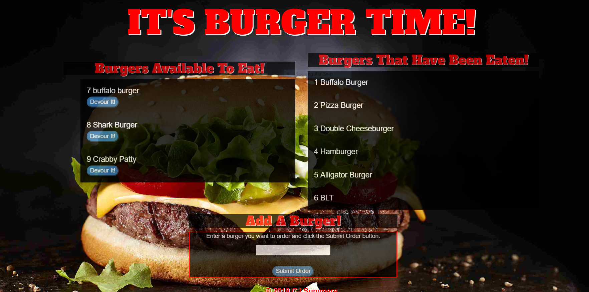

# It's Burger Time! 2 
https://secret-reaches-40497.herokuapp.com

<h2><strong>What is "It's Burger Time!"</strong></h2>
  * This is a restaurant app that lets users input the names of burgers they'd like to eat. 
  * Whenever a user submits a burger's name, the app will display the burger on the left side of the page -- waiting to be devoured. 
  * Each burger in the "Burgers Available to be Eaten" section also has a `Devour it!` button. When the user clicks it, the burger will move to the right side of the page in the "Burgers That Have Been Eaten". 
* The app will store every burger in a database, whether devoured or not. 
* The differnce between this app and the original is that this app was built using Sequelize instead of vanilla Mysql.
   
 
  
 <h2><strong>Technologies Used</strong></h2>
* NodeJS  
* NPM Packages
 <ul>
  <li> body-parser</li>
  <li> express</li>
  <li> express-handlebars</li>
  <li> method-override</li>
  <li> mysql</li>
 </ul>
 
<h2><strong>Built With</strong></h2>
* HTML/CSS  
* JavaScript  
* Bootstrap  
* Google Fonts  
* Mysql DB 
* Sequelize 

<h2><strong>Author</strong></h2>
* CJ Summers
